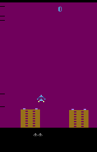
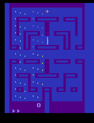
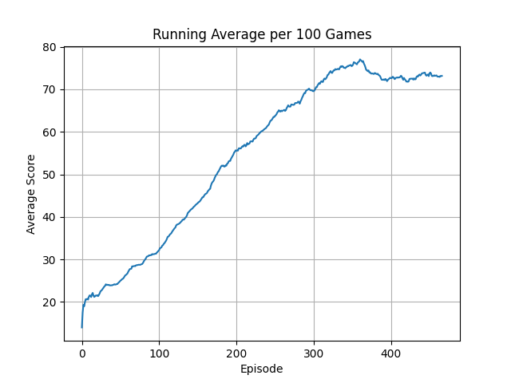
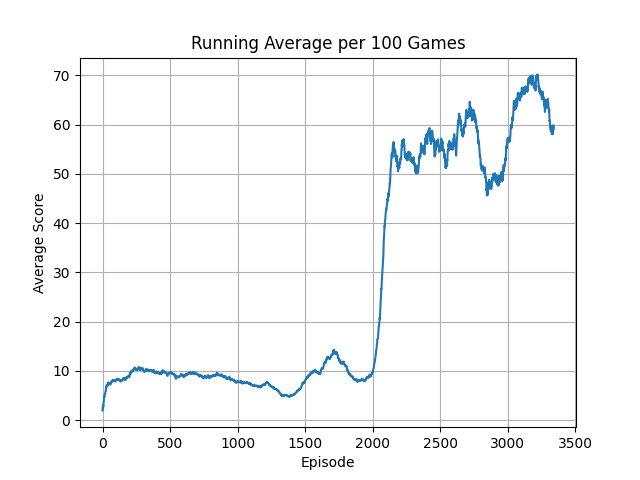
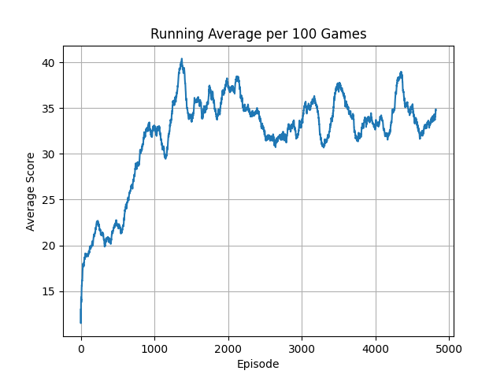
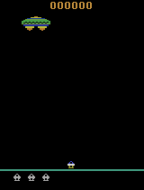
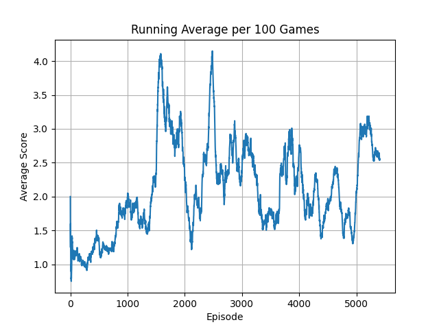
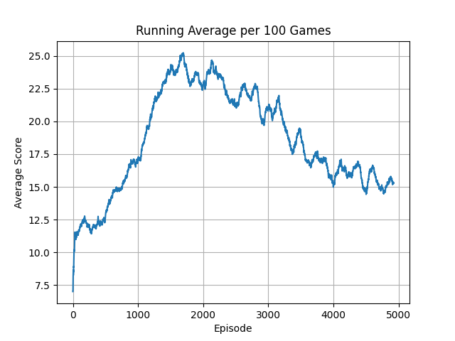

# Double Deep Q Network

## Overview

🚧 🛠️👷‍♀️ 🛑 Under construction...

## Setup

### Required Dependencies

Install the required dependencies using the following command:

```bash
pip install -r requirements.txt
```

### Running the Algorithm

You can run the algorithm on any supported Gymnasium environment. For example:

```bash
python main.py --env 'LunarLander-v2'
```

---


<table>
    <tr>
        <td>
            <p><b>MsPacman</b></p>
            
        </td>
        <td>
            <p><b>AirRaid</b></p>
            
        </td>
        <td>
            <p><b>Alien</b></p>
            
        </td>
    </tr>
    <tr>
        <td>
            
        </td>
        <td>
            
        </td>
        <td>
            
        </td> 
    </tr>
</table>
<table>
    <tr>
        <td>
            <p><b>Amidar</b></p>
            
        </td>
        <td>
            <p><b>Assault</b></p>
            
        </td>
        <!--<td>
            <p><b>Breakout-v5</b></p>
            
        </td>-->
    </tr>
    <tr>
        <td>
            
        </td>
        <td>
            
        </td>
        <!--<td>
            
        </td>-->
    </tr>
</table>


## Acknowledgements

Special thanks to Phil Tabor, an excellent teacher! I highly recommend his [Youtube channel](https://www.youtube.com/machinelearningwithphil).
